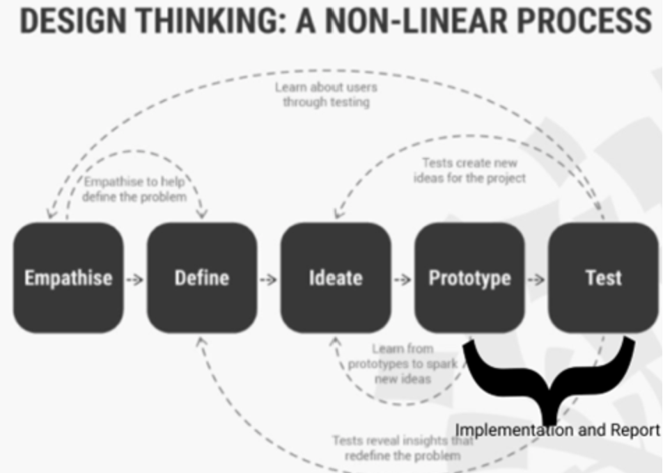
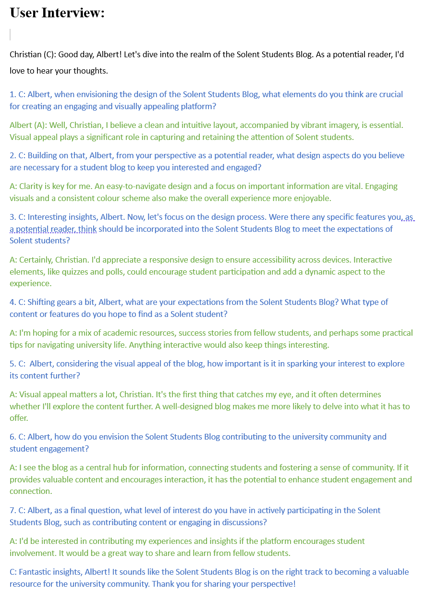

 
# <h1 text align=center>Solent University</h1>

---
  
<h1 text align=center>Contemporary Web Application</h1>
<h2 text align=center>Solent Student Blog Report AE2(70%)</h2>
  
<h2 text align=center><strong>Cristinel Zgone</strong></h2>
<h3 text align=center>University ID: 10180120</h3>
   
   

  

    <strong>Academic Year:</strong> 2023-2024 
    <strong>Module Tutor:</strong> Jubril Adigun 
    <strong>Individual/Group:</strong> Implementation and Report 
    <strong>Link to the hosted website:</strong> https://solentstudentblog.web.app/ 
    <strong>Git Repository:</strong> https://github.com/krisztian-Z/react_firebase_blog.git 
  

   
  

# Table of Content
---

- [Table of Content](#table-of-content)
- [Introduction](#introduction)
- [Methodology](#methodology)
- [Methods](#methods)
- [Pages](#pages)
- [Conclusion](#conclusion)
- [Appendices](#appendices)

  

# Introduction:
---
The preliminary assessment report outlined the results of the empathize phase, providing a comprehensive overview of insights derived from user research and analysis. Within this context, a succinct problem statement emerged: *"Solent University students face a challenge of limited connectivity, impeding their sense of community. Addressing this gap necessitates the creation of a dedicated blog web application, fostering seamless communication, facilitating knowledge sharing, and cultivating meaningful connections."* Furthermore, the report featured a prioritized set of requirements and preliminary design concepts stemming from the ideation and prototyping stages.

The focus of this Documentation Report will be on the final two phases of the Design Thinking (DT) methodology: Prototype and Testing (Implementation and Report). These phases were executed following the principles of the overarching methodology, which emphasizes adaptability, collaboration, and continuous improvement throughout the project lifecycle. The overarching methodology ensures a systematic and user-centric approach, allowing for flexibility and refinement based on feedback and evolving requirements.

Solent Students Blog is an online platform destinated for Solent's University students and not only, who are interested and passioned about programming languages. On this platform, the students have the opportunity to create blogs sharing their experiences, reaserch and knowledges related to programming languages  with the entire community. They are able to share information about the programming languages they have studied during their academic years, but also using the option 'Other' , can write and share other thoughts related to Solent University academic journey.

#### Key Features:

1. **Accessibility:** 
Alreeady have been told the website is open for public access and enjoy the content created by the Solent's students.
 
2. **User Registration:** To become a blog creator, users have to register on the website. This make certain a sense of community and control within the platform.
 
3. **Blog Creation and Editing:** Only the registered users have the privilege to create, update, and delete their own blogs.
 
4. **Content Focus:** The primary focus for this blog webpage is around programming languages learned throughout the academic journey, but not only. 
 
5. **Tag:** The website give the possibility to the blog creators to add tags for their content, and also the feature for the users and not only to search after the tag word they are interesed. 
 
6. **Search bar:** The platform also give the possibility to search content they are interested for, by title or by programming languge category.
 
7. **Like and Comment System:** Only users can acces the feature of like and comments.
 

#### Problem Statement Recap:

The first assessment identified the requirment for a in-house platform where Solent University students could share their knowledges and experiences into studied programming languages. The absence of a dedicated platform for such conversations prompted the production of this blog website. The website objective is to  provide the students a platform where they can share their own experince, to help and learn each others from their own past experince, and to build a dynamic and energetic online community within the university environmental.

Brief, the blog website is delivered as a solution to the identified issue by presenting a user-friendly interface, content categorization, and great features to increase the overall experience for Solent University students. This platform target is to build up the sense of students and programming languages community, collaboration, and knowledge interchange between the Solent's student.

  

# Methodology
---

In the initial stages of developing the blog web application, the [Design Thinking](https://www.interaction-design.org/literature/topics/design-thinking) (DT) methodology was employed, focusing on four key phases. The "Empathize" phase involved understanding the needs of Solent University students through surveys, interviews, and focus groups. In the subsequent "Define" phase, the collected data was analyzed to define the problem statement and identify key requirements. During the "Ideate" phase, collaborative brainstorming sessions generated a range of ideas and concepts for the forum web application. In the "Prototype" phase, low-fidelity prototypes were created to visualize the layout, navigation, and features. This user-centered approach ensured that the forum web application effectively addressed student challenges, fostering engagement within the university community.

 

 

The overarching methodology for the development and maintenance of the Solent Student Blog  platform is associated with a systematic and constant approach, mixing high-tech considerations with user experience improvement. The methodology can be defined in few key phases:

1. **Requirements Gathering:**

   - Identifing and understanding the Solent's  students needs and expectations regarding the blog website.
   - Conduct surveys and interviews to obtain the students vision regarding the desired features, functionalities, and the entire user experience.
 

2. **System Design:**
   - A complex and complete plan have been developed for the blog platform, delimiting the technical architecture, database structure, and user interface design.
   - Define the different react components/pages, such as user registration(Auth.js), blog creation (AddEditBlog.js), liking (LikeButton.js), commenting (UserComments.js).
 

3. **Development:**
   - Implement the system design working with appropriate technologies and programming languages (e.g.,React, Firebase).
   - Focus to build a user-friendly interface and provide smoothly navigation.
 

4. **Testing:**
   - Perform testing of the platform to spot and resolve any bugs, glitches, or usability problems.
   - The platform's security was very important too, so tests have been in place to protect user data and keep the integrity of the system.
 

5. **Deployment:**
   - Offering the blog website to users after successful testing.
   - Supervising the deployment for any unexpected issues and come up with immediate support and fixes.
 

6. **Feedback Collection and Iterative Improvement:**
   -  Verbally, collecting user feedback on the platform's functionality and user experience. A feedback was requested from the seminar class too.
   - Use feedback to make feature improvements.

By following this methodology, the development and maintenance of the Solent University student blog can be a active and responsive process, guarantee that the platform remains pertinent, user-friendly, and aligned with the progress needs of the student community.

  

# Methods 
---

To perform an intelligent evaluation of the Solent Student Blog platform, it was crucial to use diverse data collection methods that contribute with a complete understanding of user experiences, preferences, and provocations. The chosen methods it is align with the targets of the evaluation and protect the collection of essential and actionable observations. Here are few conclusive data collection methods for evaluating the result:

1. **User Surveys:**
   

   - **Justification:** Surveys are essential for obtaining quantitative data on user satisfaction, alternative, and overall usability. By addressing targeted questions, it's possible to estimate specific aspects of the website, such as the user interface, content importance, and overall experience. [Here](https://r6yve9czkeo.typeform.com/report/f3L3JNU2/2vPmhx1uKdrPyv86) you can access the report of the survey created for this project, and  from [here](https://r6yve9czkeo.typeform.com/to/f3L3JNU2) you can access the actual survey.
    
   - **Implementation:** Share online surveys to the potential users and visitors, asking about their satisfaction levels, frequency of use, and suggestions for improvement.
   

2. **User Interviews:**
   
   - **Justification:** Interviews the ones who provide in-depth qualitative data about users' thoughts, interest, and experiences. Taking one-to-one or small group interviews grant for incisive questions and a beter understanding of user viewpoint.
      

   - **Implementation:** Taking interviews with a member sample of users, including both registered users and possible visitors. Examine their interactions with the website, encountered challenges, and suggestions for improvments. See *Appendix 2 - User Interview* in [Appendices](#appendices)
    
  
   

3. **Usability Testing:**
   
   - **Justification:** Usability testing engage watching the users  when they interact with the website to find potential usability problems and some operations that can be improved. This method is necessary for analysing the effectiveness of the user interface.
      

   - **Implementation:** Create usability testing sessions with users, telling them to execute specific tasks on the website. Analyse their synergy, note areas where they struggled, and get a feedback on the overall user experience.
   
4. **A/B Testing:**
   
   - **Justification:** A/B testing it means to present different versions of the app to different users/students to tell which  version performs better in terms of user engagement.
      

   - **Implementation:** Conduct A/B testing on different features or design fundamentals, analyzing the execution of each alternative to make the best decisions on the platform's overall design and functionality.

By integrating the user testing metrics outlined in  (see [Appendix 3](#appendices))  into the evaluation process, we gained valuable insights into the user experience and usability of the forum web application. The feedback obtained from user interactions and observations proved instrumental in pinpointing areas for enhancement, ensuring that the forum aligns with the needs and expectations of the Solent University student community.

By mixing these data collection methods, the decision can offer a better understanding of user opionions, behaviors, and areas that can be improved. It's crucial to triangulate data from multiple method sources to derive overall understanding and make informed decisions for enhancing the Solent University student blog website.

  

# Pages
---

**About page:**

For this page a css page has been created, and js file is actually giving information regarding the University contact. 
The CSS file have been imported into the About.js file:
`import './About.css';`
A small footer have been created for this page.

**AddEditBlog page:**

 {
    const uploadFile = () => {
      // ...
    };

    uploadFile();
  }, [file]);

  useEffect(() => {
    // this functin get details about existing blog
    const getBlogDetail = async () => {
      // ...
    };

    // function call for blog details 
    id && getBlogDetail();
  }, [id, setActive]);`>

It contains event handling functions, such as handleChange for modifying the form state, handleTags for managing tags, and others (handleTrending, onCategoryChange , handleSubmit ).
It renders a form that allows the user to input information about the blog (title, tags, description, etc.). It includes a button to submit the blog and a success notification (using Toast) in case of a successful operation.

It uses ReactTagInput to allow users to interactively add and remove tags.
Firebase Storage is utilized for uploading and managing files associated with a blog.
It performs the update or addition of a blog based on the presence of an identifier (id) in the URL.
Toastify notifications are used to provide visual feedback to the user in case of success or error.
Interaction with Firebase:

File uploading to Firebase Storage is managed through uploadBytesResumable.
Interaction with Firestore for adding and updating documents is done through addDoc and updateDoc, respectively.
Usage of React Router:

The useNavigate and useParams hooks are used to navigate between pages and access parameters from the URL.

**Auth page:**

This page is a React component responsible for user authentication. Here are some of the key aspects of this page:

1. **Initial State and Event Handling:**
 
   - `initialState` defines the initial state of the form (with fields such as firstName, email, password, and confirmPassword).
    

   - The `useState` hook is used to manage the form state and switch between registration and login modes.
 

2. **Handling Functions:**
 
   - `handleChange` manages changes in the form fields and updates the corresponding state.
    

   - `handleAuth` is responsible for authentication and registration logic. It handles user authentication using Firebase Authentication and displays Toastify notifications based on success or error.
 

3. **Interaction with Firebase:**
 

   - `createUserWithEmailAndPassword`, `signInWithEmailAndPassword`, and `updateProfile` functions , are all used to interact with the Firebase Authentication service.
    

   - Toastify notifications are used to provide visual feedback during authentication.
 

4. **React Router and Navigation:**
 

   - The `useNavigate` hook is used to enable navigation between pages within the application.
    

   - It contains logic to redirect to the main page (`navigate("/")`) after successful authentication.
 

5. **Authentication/Registration Form:**
 

   - Renders a form that collects information such as name, email, and password.
    

   - Switches between login and registration modes, displaying or hiding additional fields based on the context.
 

6. **Notifications and Navigation Links:**
 

   - Uses Toastify notifications to provide visual feedback to the user on success or error.
    

   - Displays links to the authentication and registration pages based on the current mode (`Sign In` or `Sign Up`).
 

7. **Using Bootstrap Styles:**
 

   - Utilizes Bootstrap classes to manage the appearance and alignment of elements on the page.

These are key aspects defining the functionality and user interaction on the authentication page.

**Detail page:**

This page is using the next functions:

1. **getBlogDetail:**
- Fetches details of a specific blog post using the provided blog ID.
- Retrieves related blogs based on shared tags.

2. **handleComment:**
- Handles the logic for adding a new comment to the blog post.

3. **handleLike:**
- Is responsible fot the logic for adding or removing a like from the blog post.

**Home page:**

This page is using six functions, but i will list only few of them:

1. **Fetching Blogs:**

The `getBlogs` function retrieves an initial set of blogs, ordered by title and limited to 4 items. 
Pagination is implemented to fetch more blogs when the user clicks the "Load More" button.

2. **Search Functionality:**

- `searchBlogs` function is called when there is a search query present. It searches blogs by title and tags and updates the displayed blogs.

3. **Delete Blog Functionality:**

- `handleDelete` function is called when a user confirms the deletion of a blog. It uses the deleteDoc function to remove the blog from database (Firestore).

**App.js :**

App.js is the main entry point for the React application. It sets up the overall structure of the application, defines the routes using React Router, and manages the authentication state.

  

# Conclusion and Results:
---

Solent Student Blog's development and implementation platform have successfully addressed the meaningful need for a customised platform for Solent University students to share their experiences, ideas and knowledge related to programming languages. The platform's key features, as user registration, blog creation and updating, tagging, and search capabilities, likes and comment have contributed to building an active and collegial online group.

**Key Results:**

1. **User Engagement:**
   - The website already has a positive trend in user bond, with a growing number of registered users fervently contributing to blog creation and cooperations.

2. **Content Relevance:**
   - The essential objective on programming languages and the possibility for users to try other topics related to the Solent University academic journey have started resonating very well within the blog community.

3. **Feature Adoption:**
   - tagging and search features look like very appreciated by the users when exploring the platform. Also Trending, Most Popular and Category sections are features that make the user experince more interesting.

4. **Iterative Improvements:**
   - One of the pivotal role in improving the website were the continuous feedback, user cooments and like features. User opinions have been gladly considered and implemented.

**Reflective Evaluation:**

While the platform it might achieve a significant success, it is mandatory to reflect on the following characteristics:

1. **Usability Enhancements:**
   - User feedback and usability testing disclose some challenges in the  entire blog editing process. Future replications should prioritize improvments to streamline and upgade the user interface for blog creation and editing.

2. **Scalability and Security:**
   - As the user base will continue to incrase, scalability considerations should stay a focal point. Also, continuous and  security improvments measures is essential to keep users data protected and in the same time to keep the platform's integrity intact.

3. **Community Building:**
   - While the platform will successfully rise a sense of community, continuing efforts should be made to motivate and inspire more user interactions, chats, and collaborations within the Solent University student platform.
   

   

# Appendices
---
Appendix 1 - Design Thinking 
 

 

Appendix 2 - User Interview

 

  

  

Appendix 3 - User Testing Metrix 

 

 
